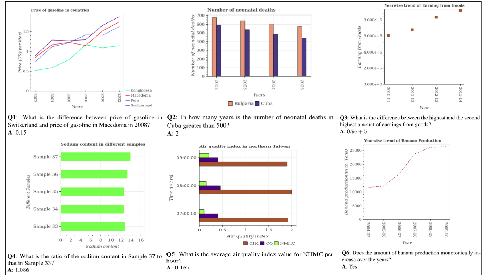

# PlotQA: Reasoning over Scientific Plots

<!--
This repository provides the PlotQA dataset which deals with the task of question-answering over a very specific class of images, namely scientific plots such as bar plots, line plots, and dot-line plots. This work is to be presented at <a href="https://wacv20.wacv.net/" target="_blank">WACV 2020</a>.
-->

This is a dedicated repository for the paper:

**[PlotQA: Reasoning over Scientific Plots](https://arxiv.org/pdf/1909.00997.pdf)**
 <br>
 <a href="https://gangulypritha.github.io/" target="_blank">Pritha Ganguly</a>,
 <a href="https://niteshmethani.github.io/" target="_blank">Nitesh Methani</a>,
 <a href="https://www.cse.iitm.ac.in/~miteshk/" target="_blank">Mitesh Khapra</a>,
 <a href="http://www.cse.iitm.ac.in/~pratyush/" target="_blank">Pratyush Kumar</a>


The paper deals with the task of question-answering over a very specific class of images, namely scientific plots such as bar plots, line plots, and dot-line plots. This work is to be presented at <a href="https://wacv20.wacv.net/" target="_blank">WACV 2020</a>.


### What is PlotQA?
PlotQA is a VQA dataset with 28.9 million question-answer pairs grounded over 224,377 plots on data from real-world sources and questions based on crowd-sourced question templates. 

### Why PlotQA?
Existing synthetic datasets ([FigureQA](https://arxiv.org/pdf/1710.07300.pdf), [DVQA](https://arxiv.org/pdf/1801.08163.pdf)) for reasoning over plots do not contain variability in data labels, real-valued data, or complex reasoning questions. Consequently, proposed models for these datasets do not fully address the challenge of reasoning over plots. In particular, they assume that the answer comes either from a small fixed size vocabulary or from a bounding box within the image. However, in practice this is an unrealistic assumption because many questions require reasoning and thus have real valued answers which appear neither in a small fixed size vocabulary nor in the image. In this work, we aim to bridge this gap between existing datasets and real world plots by introducing PlotQA. Further, 80.76% of the out-of-vocabulary (OOV) questions in PlotQA have answers that are not in a fixed vocabulary.

<!-- To know more about PlotQA, read our full paper [here](https://arxiv.org/pdf/1909.00997.pdf). -->

Few examples of the {plot, question, answer} triplets from the PlotQA dataset are given below:

<p float="center">
	<!---  --->
	
</p>

#

To download the dataset, click [here](https://github.com/NiteshMethani/PlotQA/blob/master/PlotQA_Dataset.md).

To check the code for our proposed pipeline, click [here](https://github.com/NiteshMethani/PlotQA/blob/master/PlotQA_Pipeline.md).

#
# Citation

Please cite the following if you use the PlotQA dataset in your work:
```
@InProceedings{Methani_2020_WACV,
author = {Methani, Nitesh and Ganguly, Pritha and Khapra, Mitesh M. and Kumar, Pratyush},
title = {PlotQA: Reasoning over Scientific Plots},
booktitle = {The IEEE Winter Conference on Applications of Computer Vision (WACV)},
month = {March},
year = {2020}
} 
```

#
# Contact
If you have any questions, suggestions or comments about the dataset in the paper, feel free to contact us at:
Nitesh Methani (nmethani@cse.iitm.ac.in), Pritha Ganguly (prithag@cse.iitm.ac.in).
